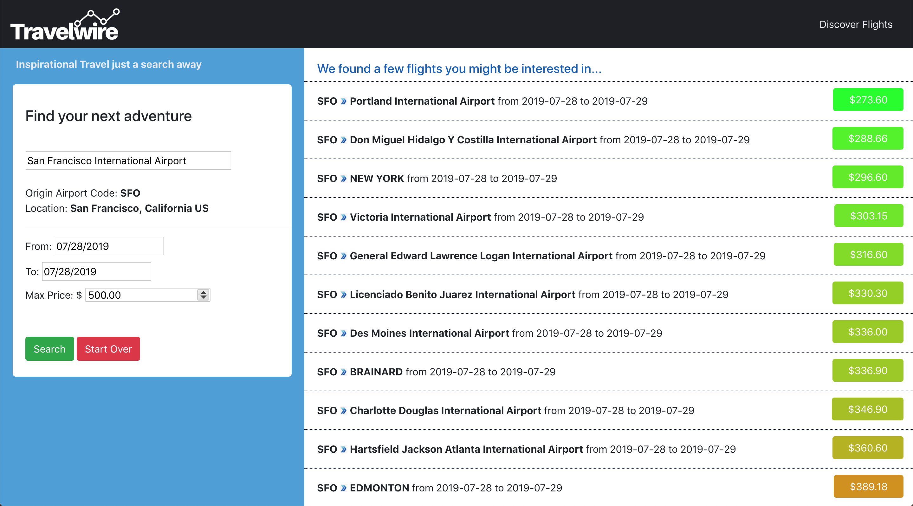

    

### Travel Wire

Your connection to cheap flights and inspiration-based travel.

### Concept

Many travel sites, such as skyscanner/priceline/google, have robust and existing ways of finding the cheapest flights from point A or to point B. Leveraging the Amadeus cheap flight API, Travelwire is a inspiration-travel web app that focuses on finding the cheapest flights that fit your time criteria with an unknown and potentially suprising destination. 

Travelwire serves the population that wants to get away on a budget, or looking for ways to travel spontaneously.

Demo: https://travelwire.firebaseapp.com/

### Running the app
Retrieve your amadeus app key and secret, set the following env variables.

<pre>
    REACT_APP_AMADEUS_KEY=XXX
    REACT_APP_AMADEUS_SECRET=XXX
</pre>

Start the web server:

<pre>
    yarn
    yarn start
</pre>

Note to use the `serve.sh` script for deploying the project you will need to configure your own firebase app credentials. Alternatively, use the hosting provider of your choice.

### Screenshots

#### Home page

    

#### Flight results

    

#### Selecting a Flight

    

#### Link to book

    

